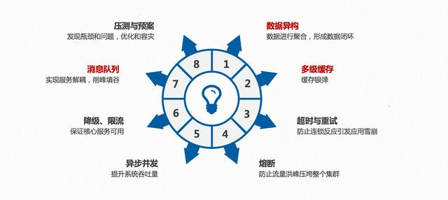

# High Availability Architectures

## [What Is HA](What.md)

## [流量控制](Traffic/README.md)
### [限流](Traffic/Peak-Clipping/README.md)
### [削峰](Traffic/Throttling/README.md)
### [流量整型]()

## 服务
### [服务隔离](Service/Isolated.md)
### [服务降级](Service/Downgrade.md)
### [服务熔断](Service/Fusing.md)

## [负载平衡（Load balancing）](LoadBalancing/README.md)

## [监控](Monitor/README.md)

## [多数据中心](Multi-DataCenter/README.md)

## [框架](framework/README.md)
### Hystrix
### Sentinel

## Middleware
### [Apache ZooKeeper](https://github.com/SunnnyChan/sc.drill-code/tree/master/infra/apache-zookeeper)

## 参考
### [可伸缩架构 : 面向增长应用的高可用](https://github.com/SunnnyChan/SunnnyChan.github.io/blob/master/post/readme/reading/arch/scalable_arch)
### [分布式服务框架：原理与实践](https://github.com/SunnnyChan/SunnnyChan.github.io/blob/master/post/readme/reading/arch/DS-Service-Framework)
