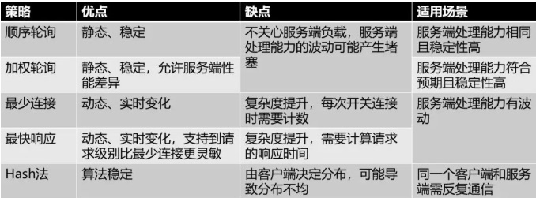

# 轮询策略
## 顺序轮询

在DNS方案中用的比较多，无需关注后端服务的状态。

## 随机轮询
## 加权轮询

# 负载度策略
充分的结合了后端服务器的运行状态，来动态的分配流量了，比轮询的方式更为科学一些。
这种方式带来了效果优势的同时，也增加了「负载均衡器」的实现难度和维护成本。

* 连接数
* 请求数
* CPU负载指标
* IO负载指标

# 响应策略
* 最快响应
需要「负载均衡器」不停的去统计每一台后端服务器对请求的处理速度。

# 哈希策略

结果是由客户端决定的，通过客户端带来的某个标识经过一个标准化的散列函数进行打散分摊。

## Hash 一致性

# 其它

想要更优的效果，必然就需要更高的复杂度。
比如，可以将简单的策略组合使用、或者通过更多维度的数据采样来综合评估，
甚至是基于进行数据挖掘后的预测算法来做

