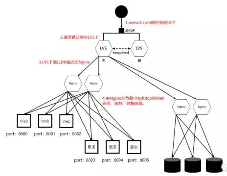

# Load Balancer Design

# [基于 DNS 负载均衡](BasedOnDNS.md)
# [基于硬件负载均衡](BasedOnHardware.md)
# [基于软件负载均衡](BasedOnSoftware.md)

# [转发策略](ForwardingStrategies/README.md)

# 应用实践

* 利用DNS 的域名解析所带的负载均衡效果

只要复制多套 LVS 主备出来，绑上多个不同的虚 IP。可以做到无限横向扩展，以支撑不断增长的流量。

* LVS+Keepalived 负责做 Nginx 的负载均衡
* Nginx 负责分发实际的请求到 HTTP 和 TCP 协议的应用上
	