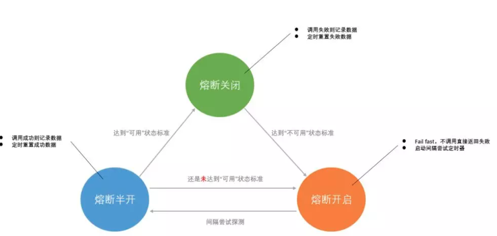

# 服务熔断
## What Is ?
```md
如果某个服务 A 需要发布一个新版本，往往会对正在运行的其他依赖服务 A 的程序产生影响。
甚至，一旦服务 A 的启动预热过程耗时过长，问题会更严重，大量请求会阻塞，产生级联影响，导致整个系统卡慢。

举个夸张的例子来形容：
一幢楼的下水管是从最高楼直通到最低楼的，这个时候如果你家楼下的管道口堵住了，
那么所有楼上的污水就会倒灌到你家，如果这导致你家的管道口也堵住了，之后又会倒灌到楼上一层，以此类推。
```
```md
熔断本质上是一个过载保护机制，概念来源于电子工程中的断路器，可能你曾经被这个东西的“跳闸”保护过。
在互联网系统中的熔断机制是指，当下游服务因访问压力过大而响应变慢或失败，
上游服务为了保护自己以及系统整体的可用性，可以暂时切断对下游服务的调用。
```
```md
熔断只是一个保护壳，在周围出现异常的时候保全自身，
但是从长远来看平时定期做好压力测试才能更好的防范于未然，降低触发熔断的次数。

如果清楚的知道每个系统有几斤几两，在这个基础上再把「限流」和「降级」做好，这基本就将“高压”下触发熔断的概率降到最低了。
```
## 中心思想
```md
量力而行 : 什么样的性能支撑多少流量是固定的，这是根本。
```
## 步骤
### 不可用探测
```md
定义一个识别是否处于“不可用”状态的策略
	调通
	耗时
```
```md
偶发的瞬时异常，避免以偏概全。
```
```md
时间窗口
	用来“放宽”判定“不可用”的区间，意味着多给了系统几次证明自己“可用”机会。
	如果系统还是在这个时间窗口内达到了你定义“不可用”标准，那么我们就要“断臂求生”了。

	标准
		阈值 比如，在 10 秒内出现 100 次“无法连接”或者出现 100 次大于 5 秒的请求
		百分比 比如，在 10 秒内有 30% 请求“无法连接”或者 30% 的请求大于5秒
```
### 切断联系
* 「fail fast」机制
```md
切断联系要尽可能的“果断”
    既然已经认定了对方“不可用”，那么索性就默认“失败”，避免做无用功，也顺带能缓解对方的压力
作为客户端一方，在自己进程内通过代理发起调用之前就可以直接返回失败，不走网络
```
### 可用探测
```md
定义一个识别是否处于“可用”状态的策略，并尝试探测
需要尽快恢复，以提供完整的服务能力。
```
```md
* 策略
阈值 比如，在 10 秒内出现 100 次“调用成功”并且耗时都小于 1 秒
百分比 比如，在 10 秒内有 95% 请求“调用成功”并且 98% 的请求小于1秒
```
```md
不需要像第一步中识别“不可用”那样，无时无刻的记录请求状况，而只需要在每隔一段时间之后去进行探测即可。

「间隔时间」
	可以是固定的，比如 30 秒
	可以是动态增加的，通过线性增长或者指数增长等方式
```
```md
“试错成本”
	尝试探测本质上是一个“试错”，要控制下“试错成本”，所以我们不可能拿 100% 的流量去验证。
	一般会有以下两种方式
		放行一定比例的流量去验证
		如果在整个通信框架都是统一的情况下
			还可以统一给每个系统增加一个专门用于验证程序健康状态检测的独立接口。
			这个接口额外可以多返回一些系统负载信息用于判断健康状态，如 CPU、I/O 的情况等。
```
### 重新恢复正常
```md
此时需要重新开启识别“不可用”的策略
```



## 设计要点
```md
定义触发熔断的错误类型
所有触发熔断的错误请求必须要有统一的日志输出
熔断机制必须有服务诊断及自动恢复能力
最好为熔断机制设置手动开关用于三种状态的切换
熔断要切分业务，做到业务隔离熔断
```
## 实践指导
### 什么场景最适合做熔断
```md
所依赖的系统本身是一个共享系统
	当前客户端只是其中的一个客户端，这是因为，如果其他客户端进行胡乱调用也会影响到你的调用。
所有依赖的系统被部署在一个共享环境中（资源未做隔离）
	并不独占使用，比如，和某个高负荷的数据库在同一台服务器上。
所依赖的系统是一个经常会迭代更新的服务
	这点也意味着，越“敏捷”的系统越需要“熔断”。
当前所在的系统流量大小是不确定的
	比如，一个电商网站的流量波动会很大，你能抗住突增的流量不代表所依赖的后端系统也能抗住。
	这点也反映出了我们在软件设计中带着“面向怀疑”的心态的重要性。
```
### 注意
```md
如果所依赖的系统是多副本或者做了分区的，那么要注意其中个别节点的异常并不等于所有节点都存在异常，需要区别对待。
熔断往往应作为最后的选择，应优先使用一些「降级」或者「限流」方案，
	因为“部分胜于无”，虽然无法提供完整的服务，但尽可能的降低影响是要持续去努力的。
	比如，抛弃非核心业务、给出友好提示等等
```
### 实现
```md
熔断代码所在的位置要么在实际方法之前，要么在实际方法之后。
它非常适合 AOP 编程思想的发挥，所以我们平常用到的熔断框架都会基于 AOP 去做。
```